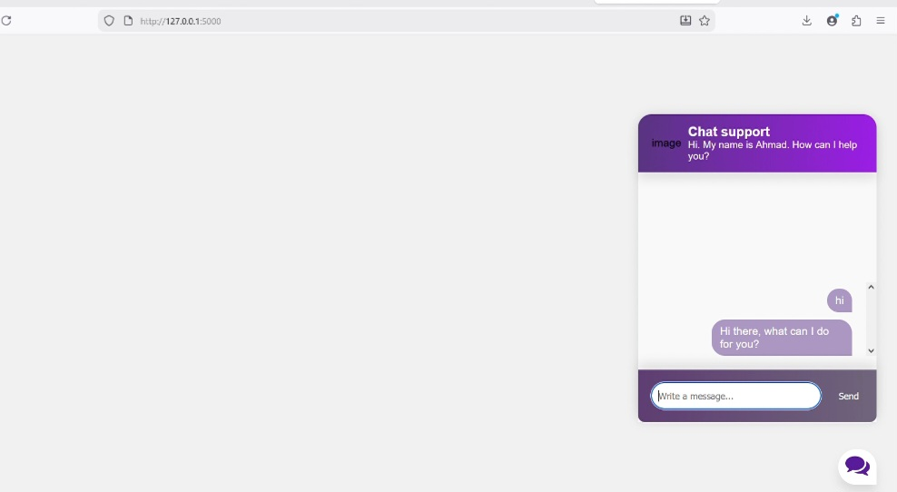
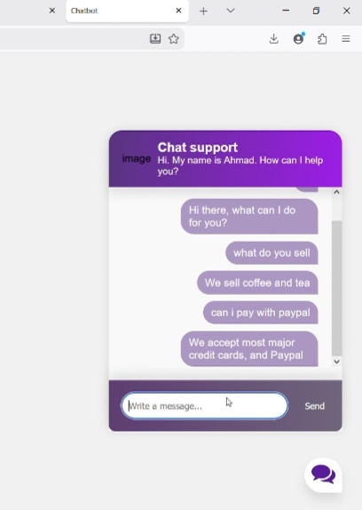
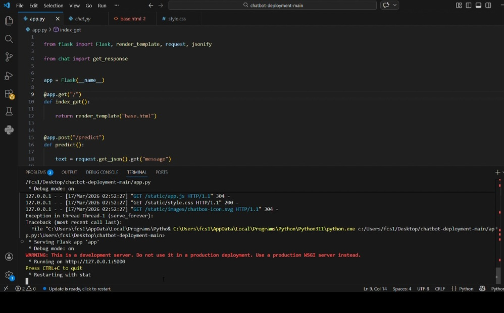

# AI Chatbot with PyTorch & NLP
## Overview

This project is a Neural Network-based chatbot built from scratch using PyTorch and NLTK.
It classifies user input into predefined intents and generates responses based on trained patterns.

The system demonstrates a full end-to-end NLP pipeline, including:

Text preprocessing (tokenization & stemming)

Feature extraction (Bag of Words)

Model training

Inference & deployment (Flask)

## How It Works

The chatbot follows a simple but effective pipeline:

Tokenization

Splits input sentence into words using NLTK

Stemming

Reduces words to their root form

Example: organizing → organ

Bag of Words

Converts text into numerical vectors

Neural Network

Feedforward model classifies input into intent tags

Response Selection

Matches predicted tag with responses from `intents.json`

## Project Structure
NeuroChat-AI/
│
├── static/
│   ├── images/
│   ├── app.js
│   ├── style.css
│   └── Results/
│       ├── R1
│       ├── R2
│       └── R3
│
├── templates/
│   └── base.html
│
├── app.py            # Flask backend (API)
├── chat.py           # Chat logic (prediction + response)
├── model.py          # Neural network architecture
├── train.py          # Training pipeline
├── nltk_utils.py     # NLP preprocessing
├── intents.json      # Training data (intents & responses)
├── data.pth          # Trained model (generated)
├── LICENSE
## Model Architecture

The model is a 3-layer Feedforward Neural Network:

Input: Bag-of-Words vector

Hidden Layers: Fully connected + ReLU

Output: Intent classification

Linear → ReLU → Linear → ReLU → Linear

✔ Uses `CrossEntropyLoss`
✔ Optimized with `Adam`

## Training Details

`Epochs: 1000`

`Batch Size: 8`

`Learning Rate: 0.001`

`Loss Function: CrossEntropyLoss`

`Optimizer: Adam`

### The trained model is saved as:
`data.pth`

## How to Run
1-Clone the repository

git clone https://github.com/yourusername/chatbot-deployment.git

cd chatbot-deployment
2-Install dependencies
Run
```
pip install -r requirements.txt
```
3-Train the model
```
python train.py
```
4-Run the chatbot
```
python app.py
```
# Result


### running Image


Place your image inside static/images/

## Key Components
`nltk_utils.py`

Handles:
```
Tokenization

Stemming

Bag-of-Words vectorization
```
` train.py`
```
Prepares dataset

Trains neural network

Saves model
```
`model.py`

Defines the neural network architecture.

`app.py`
```
Flask API

Handles user requests

Returns chatbot responses
```
## Future Improvements

Add deep learning models (LSTM / Transformers)

Improve dataset with more intents

Add confidence threshold tuning

Deploy on cloud (Render / AWS / Docker)

## Author

Nisar Ahmad Zamani
Machine Learning Engineer

GitHub: https://github.com/NisarAhmad7

LinkedIn: https://www.linkedin.com/in/nisar-ahmad-zamani-7b10b63a9/

## License

This project is licensed under the MIT License.

## Final Note

This project focuses on understanding core NLP + Deep Learning concepts, not just using pre-built APIs.
It’s a strong foundation for building more advanced conversational AI systems.
